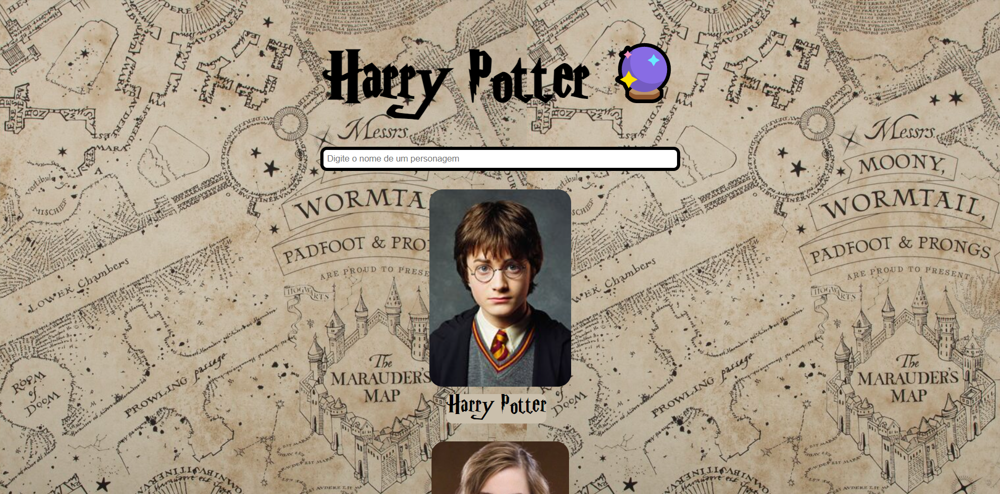

# React II :tada:
## Projeto desenvolvido na 15ª Semana de aulas do curso de Desenvolvimento Web Front-End da 10ª Turma da Reprograma :purple_heart:

---
### :dart: Objetivos 

Criar um projeto React, consumir uma API externa, criar um componente título a ser renderizado por props ou children e criar um componente que mapeia os dados da lista da API e retorna uma lista que também terá um input que pegará o texto digitado para atualizar o estado do componente, mostrando na tela somente o valor digitado. Utilizar hooks e eventos.

---
### :books: Principais aprendizados

* Hooks internos
* State
* Ciclo de Vida
* Eventos (onClick, onChange) 
* Hooks (useState, useEffect)
* API (fetch, async await, axios)
* Toggles

---
### :wrench: Tecnologias 

- HTML 5
- CSS3
- JavaScript
- React.js
- Node.js

---
### :chart: Resultado

